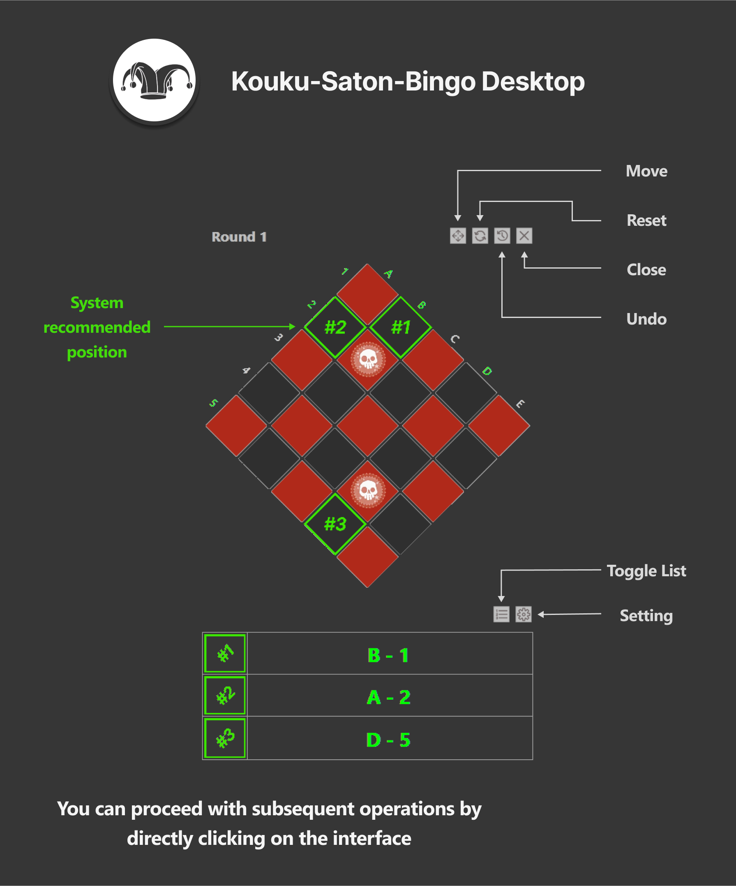

<h1 align="center">Kouku-Saton-Bingo Desktop</h1> 

<h4 align="center">【This project is a remake of the
<a href="https://github.com/ialy1595/kouku-saton-bingo">Kouku-Saton-Bingo</a> open source project】 
</h4>

After going through the launch of the Clown Raid on the Taiwan server and using the web-based support tool, I encountered two issues:

- __Players without dual monitors will need to constantly switch between windows.__
- __Players with dual monitors experience large mouse movements when interacting with the webpage.__

As a result, I started thinking about how to make the chessboard float above the game interface to address these two problems.

 

## 📋 Feature Introduction

In addition to the basic features, some additional functions have been adjusted and added to enhance the user experience:

<h3 align="left">【2024-09-26】 </h4>

* __Modified the minimum window size__
* __Add new software installation tool__

<h3 align="left">【2024-09-12】 </h4>

* Adjust the settings interface position to make it easier for users to personalize their settings 
* Added window position memory function: the software will now remember the last used position when closed
* Added numbering hint feature: can be turned on or off based on personal preference, and the setting will be saved

The contents of each feature are shown in the image below.

 

 

## 📝 Version Information

__Current Version:__ [v24.20.1.1](https://github.com/kenait1224/Kouku-Saton-Bingo-Desktop/releases/tag/v24.20.1.1)

__Version Change Log:__ [VERSIONLOG.md](VERSIONLOG.md)

 

##  ❔ Question & Answer
__Q1. Why is there a discrepancy between the recommended positions on the website?__

A1. The difference is due to variations in the sorting algorithm. Essentially, the discrepancy occurs when multiple positions have the same score, and the algorithm prioritizes different items for selection.

 

__Q2. Is it possible to provide a 4-player connection feature?__

A2. We are currently evaluating this feature. Due to limited development time and the need to provide servers for connection, we need to assess risks such as DDOS attacks. As a result, if this feature is developed, it may initially limit the number of connected players.

 

__Q3. Does using this software violate any regulations?__

A3. This software does not read or write any in-game memory, so you can think of it as a browser floating above the game. It functions similarly to the [Maxroll (Kakul-Saydon Bingo Assistant)](https://maxroll.gg/lost-ark/kakul-bingo) you are currently using but with some optimized recommendations, display, and functionality.

 

__Q4. Can a numbered mode be added?__

A4. Yes, it is currently under development. The numbered mode will provide a list showing the recommended positions by number, allowing players to quickly identify the optimal positions. __(Update completed on September 12, 2024)__

 

__Q5. Why is it blocked by Windows Defender SmartScreen?__

A5. Software that is not from a recognized company usually lacks a digital signature when released, which may cause it to be flagged as a potential risk.

 

__Q6. Why is there no option to use Inanna?__

A6. Since Inanna is rarely used in actual gameplay, this feature was not prioritized during development. If there is demand in the future, it will be updated accordingly.

 

__Q7. Will there be an Inferno Mode option available later?__

A7. Yes, as of now, the behavior differences in Inferno Mode have not been confirmed. This feature will be added once the mechanics of Inferno Mode are well understood.

 

## 🔑 License

Copyright (c) 2021 ialy1595.

Copyright (c) 2024 kenait1224. All rights reserved.

Licensed under the [MIT](LICENSE.txt) license.

